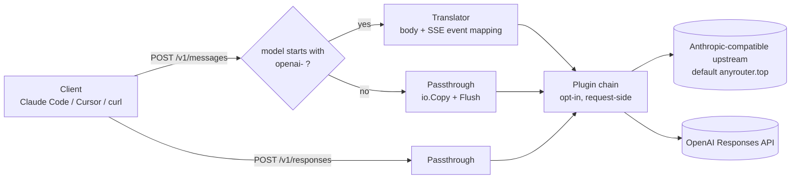

<!-- init-arch:v1 -->

# Architecture: any-gateway

## 1. System architecture

`any-gateway` is a single Go binary that runs on a developer's Mac and proxies
LLM HTTP traffic between local clients (Claude Code, Cursor, scripts) and one
of two upstreams. It has no persistent state and no background work — every
request is handled inline on the goroutine that accepted it.

The dispatcher reads `model` from the inbound request body. If `model` starts
with `openai-`, the request goes through the **translator path**: the prefix is
stripped, the body is translated from Anthropic Messages to OpenAI Responses,
and the upstream SSE stream is parsed event-by-event and re-emitted in
Anthropic SSE shape. Every other request goes through the **passthrough
path**: bytes are copied to the configured Anthropic-compatible upstream
(default `https://anyrouter.top`) using `io.Copy` against an `http.Flusher`
ResponseWriter, with no parsing.

A request-side plugin chain sits between the dispatcher and the outbound HTTP
client. Plugins are pure functions over the outbound `*http.Request` and run
in registration order. All plugins are opt-in — the gateway ships with every
plugin disabled, plus one in-box `headerinject` plugin that adds a configured
header to every upstream request when enabled.

`POST /v1/responses` is a third route that always passes through verbatim to
OpenAI, for clients that already speak the Responses API.



## 2. Technical constraints

- **Latency:** added overhead must stay under 1 ms on the passthrough path and
  under 5 ms to first byte on the translator path, measured against direct
  client-to-upstream baselines. Upstream RTT dominates total latency; the
  gateway must not add a perceptible tax on top.
- **Throughput:** single-developer workload. Concurrency is bounded by what
  one editor session generates (low tens of in-flight streaming requests at
  worst). No throughput SLO.
- **Deploy environment:** `localhost` on the developer's Mac, run as a
  foreground process. Not designed for shared/multi-tenant deployment.
- **OS support:** macOS only — `darwin/arm64` and `darwin/amd64`. No Linux,
  no Windows in scope.
- **Statelessness:** no API keys or secrets on disk or in environment, no
  caching, no rate limits, no shared memory between requests. Client-supplied
  upstream credentials (`x-api-key`, `Authorization`) are read from the
  inbound request and written to the outbound request — never logged, never
  retained.
- **Trust boundary:** the OS process boundary on the local Mac. Listener
  binds to `127.0.0.1` only; any process on the same machine is trusted and
  no client-side authentication is enforced. The gateway never owns secrets;
  it only forwards what the client sent.

## 3. Technology stack

- **Language:** Go 1.22+ (required for `http.ServeMux` method+path patterns),
  built and released on current stable.
- **HTTP server:** `net/http` stdlib + `http.ServeMux`. No external router
  framework. Plugin chain implemented as a `[]func(*http.Request) error`
  slice run in registration order against the outbound request, after
  dispatch and before `http.Client.Do`.
- **HTTP client (outbound):** stdlib `net/http` with the default `Transport`
  reused across requests. Streaming bodies are forwarded to the
  `http.ResponseWriter` via `io.Copy` with explicit `http.Flusher.Flush()`
  calls per chunk.
- **JSON:** stdlib `encoding/json`. Request bodies and per-event SSE payloads
  are small (≤ ~50 KB and ≤ ~2 KB respectively); stdlib performance is
  comfortable inside the latency budget.
- **Config:** TOML, parsed with `github.com/BurntSushi/toml`. Default
  location `$XDG_CONFIG_HOME/any-gateway/config.toml` with
  `~/.config/any-gateway/config.toml` fallback; overridable via `--config`
  flag.
- **Logging:** `log/slog` (stdlib). Default text handler on stdout; JSON
  handler available via config flag for machine consumption.

## 4. External integrations

- **AI/ML:**
  - Anthropic-compatible Messages API — default upstream
    `https://anyrouter.top`, configurable. Endpoint: `POST /v1/messages`.
    The gateway preserves headers, streaming, and the original `model`
    field on the passthrough path.
  - OpenAI Responses API — `https://api.openai.com/v1/responses`. Used
    on the translator path (when `model` starts with `openai-`) and on the
    `POST /v1/responses` passthrough route.
- **Observability:** stdout structured access log only. One line per
  request with timestamp, method, path, model, upstream host, status,
  duration, bytes-up, bytes-down. Errors share the same stream. No
  payload logging, no auth-header logging, no `/metrics` endpoint.

## 5. Project structure

Single Go module, `cmd/` + `internal/` split. The translator gets its own
package because its surface (request body, SSE event mapping, tools, system
prompt, multi-turn, errors, usage reporting) dominates the codebase. The
plugin chain is a separate package so plugins can declare a public interface
without leaking server internals.

```
any-gateway/
  cmd/
    any-gateway/
      main.go            # flag parsing, config load, server.Run
  internal/
    server/              # listener, mux registration, dispatcher
    proxy/               # passthrough byte-stream forwarder
    translate/           # Anthropic <-> OpenAI translator
      request.go         # body translation
      sse.go             # SSE event mapping
      tools.go           # tool-use translation
    plugin/              # plugin interface + chain runner
      headerinject/      # in-box header-injection plugin
    config/              # TOML loader, defaults, validation
  go.mod
  go.sum
  README.md
  specs/
    architecture.md      # this document
```

## 6. Deployment architecture

- **Runtime location:** developer's Mac, foreground process. The user
  launches the binary in a terminal tab; the binary listens on `127.0.0.1`
  at a configurable port (default `8787`, chosen to avoid common dev-tool
  collisions).
- **Distribution:** GitHub Releases only. Each tag triggers a CI build that
  cross-compiles `darwin/arm64` and `darwin/amd64` binaries and uploads
  them to the release. Users install by downloading the asset, or via
  `go install github.com/zhouweiwei/any-gateway/cmd/any-gateway@latest` if Go
  is available locally. No Homebrew tap.
- **CI/CD:** GitHub Actions, two workflows. CI on PR runs `go vet`, `go
  test ./...`, and `goreleaser check` on the release config. Release on
  tag push runs `goreleaser release` and publishes the GitHub Release
  with the built artifacts.

## 7. Key technical decisions

### ADR-1: Stateless single-binary local proxy
- **Context:** The product hypothesis is that LLM clients should be able to
  redirect traffic without trusting a remote proxy with credentials or
  history.
- **Decision:** Ship a single Go binary that runs on `localhost`, stores no
  secrets, holds no caches, and shares no memory between requests.
- **Consequence:** No persistence layer to design, build, or back up. Every
  feature must be expressible as request-time computation; anything that
  would need state (rate limiting, response caching, token accounting
  across requests) is explicitly out of scope.

### ADR-2: Split paths — byte-stream passthrough vs. parsing translator
- **Context:** The Anthropic→Anthropic and OpenAI→OpenAI flows can be
  forwarded byte-for-byte; only Anthropic→OpenAI requires parsing because
  the SSE event names and JSON shapes differ.
- **Decision:** Two execution paths. Passthrough uses `io.Copy` + explicit
  flushing with no JSON parsing. The translator parses each upstream SSE
  event, transforms to Anthropic event shape, and re-emits.
- **Consequence:** Passthrough latency stays within the <1 ms budget by
  construction. Translation logic is isolated in `internal/translate/`. Cost:
  two code paths to test and maintain, and response-side plugins (if ever
  added) would need to be retrofitted onto both.

### ADR-3: stdlib `net/http` + `http.ServeMux`, no router framework
- **Context:** The HTTP surface is 2 routes (`POST /v1/messages`,
  `POST /v1/responses`). Go 1.22 added method+path patterns to
  `ServeMux`.
- **Decision:** Use stdlib only — no chi, gin, or echo. Plugin chain is a
  short slice of `func(*http.Request) error` mutators run against the
  outbound request.
- **Consequence:** Zero framework overhead on the hot path. Dependency graph
  stays tiny. Cost: future routes that want richer middleware composition
  will need a small custom layer or a future migration to chi.

### ADR-4: TOML for configuration
- **Context:** Config holds upstream URL, listener address, plugin list,
  per-plugin params, log format. Edited by humans.
- **Decision:** TOML via `github.com/BurntSushi/toml`. JSON and YAML
  rejected — JSON has no comments and is awkward to hand-edit; YAML has
  type-ambiguity bugs and indentation traps.
- **Consequence:** One small dependency. Config is comment-friendly and
  unambiguous. Cost: TOML's nested-table syntax is less compact than YAML
  for deeply-nested config, but plugin config is shallow here.

### ADR-5: 127.0.0.1-only listener, no client auth
- **Context:** The gateway has no secrets of its own; all upstream credentials
  ride on inbound requests. Trust model needs to match.
- **Decision:** Bind exclusively to `127.0.0.1`. Do not implement client-side
  authentication. Rely on the OS process boundary as the trust boundary.
- **Consequence:** No auth code to design or maintain. Cannot be exposed on
  a LAN without a future architectural change. Any process on the same Mac
  can use the gateway, which is acceptable for a personal dev tool.

### ADR-6: macOS-only release via GitHub Releases (no Homebrew tap)
- **Context:** Primary users are Claude Code / Cursor users on Mac. Mac-only
  scope simplifies the release matrix and eliminates Linux/Windows path edge
  cases.
- **Decision:** Release `darwin/arm64` and `darwin/amd64` binaries via
  GitHub Releases (driven by goreleaser in CI). Users install by binary
  download or `go install`. No Homebrew tap.
- **Consequence:** Two-arch build matrix only. No tap repo to maintain. Cost:
  install UX is one step rougher than `brew install`; users without Go must
  download manually. Adding a tap later is a goreleaser config change, not
  an architecture change.
